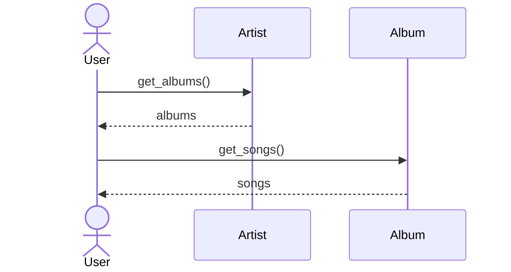
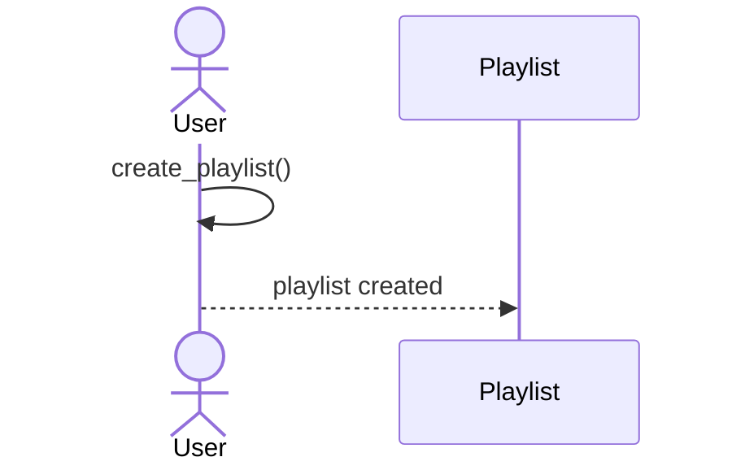
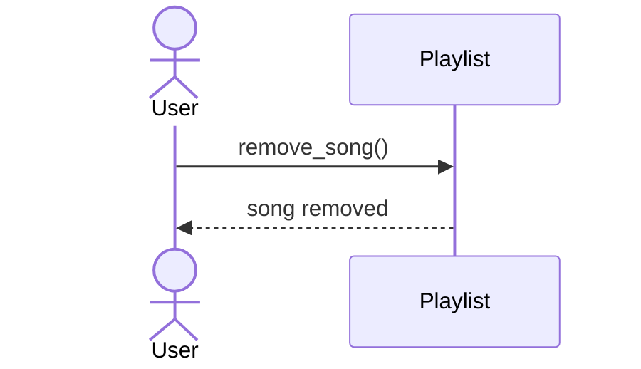
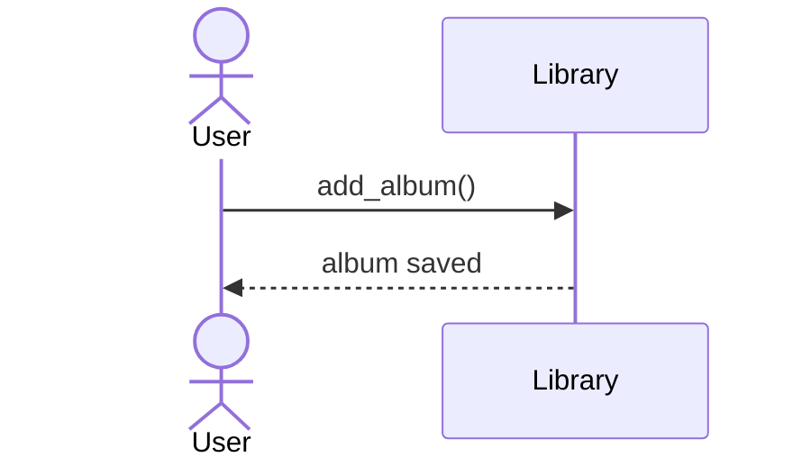
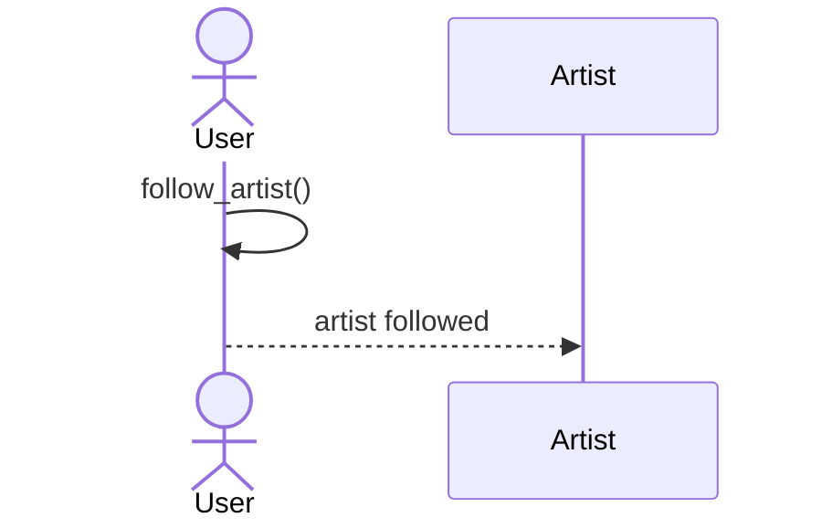
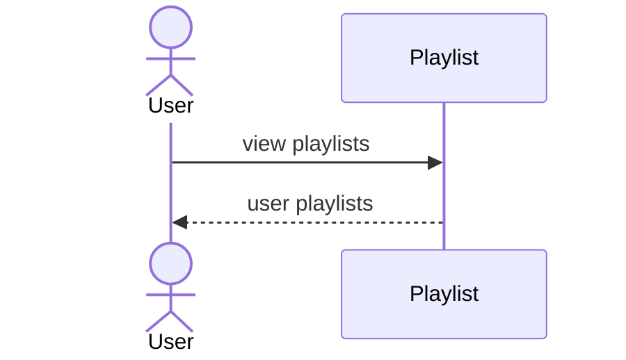
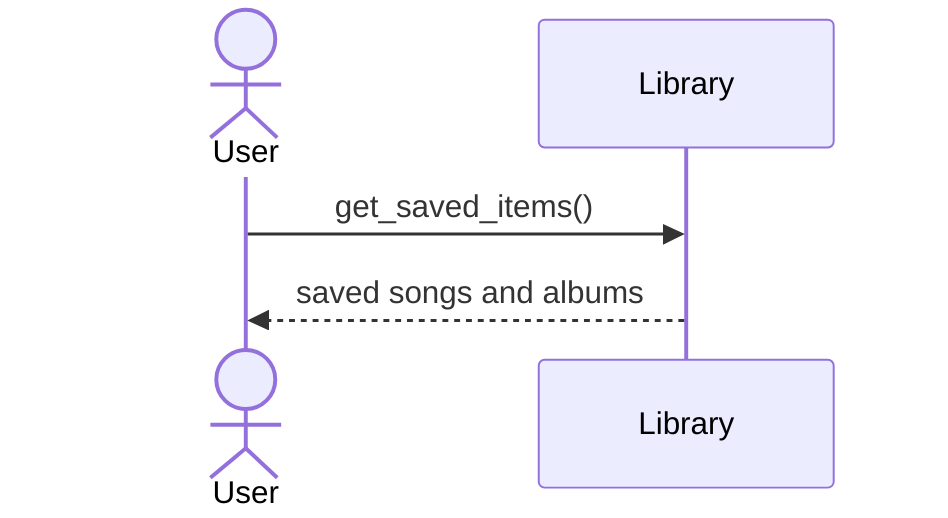

# Music Streaming Platform - Sequence Diagrams

## 1. Browse Songs and Albums

## 2. Create a Playlist

## 3. Add a Song to a Playlist

## 4. Remove a Song from a Playlist

## 5. Save a Song to the Library

## 6. Save an Album to the Library

## 7. Follow an Artist

## 8. View User Playlists

## 9. View Saved Songs and Albums

